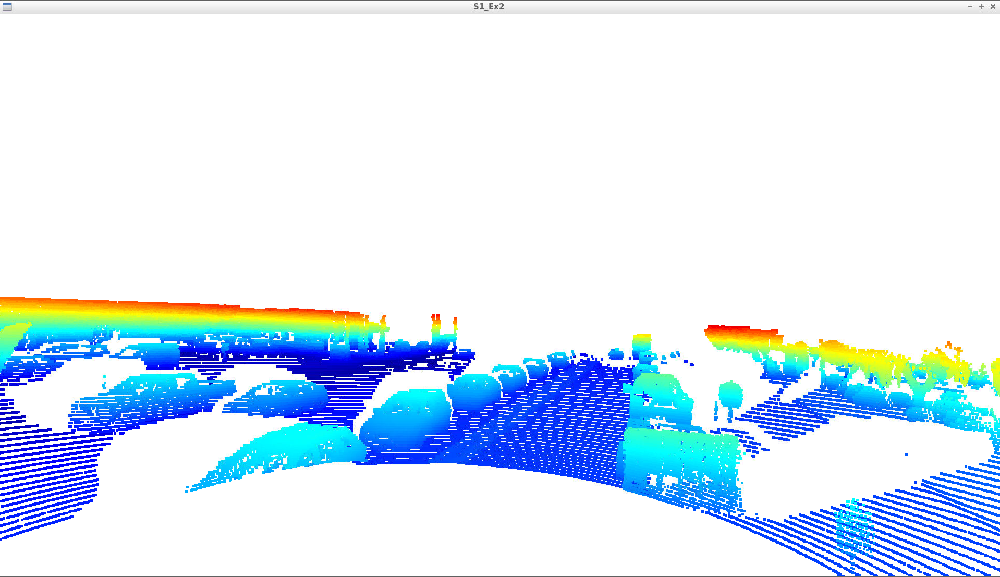
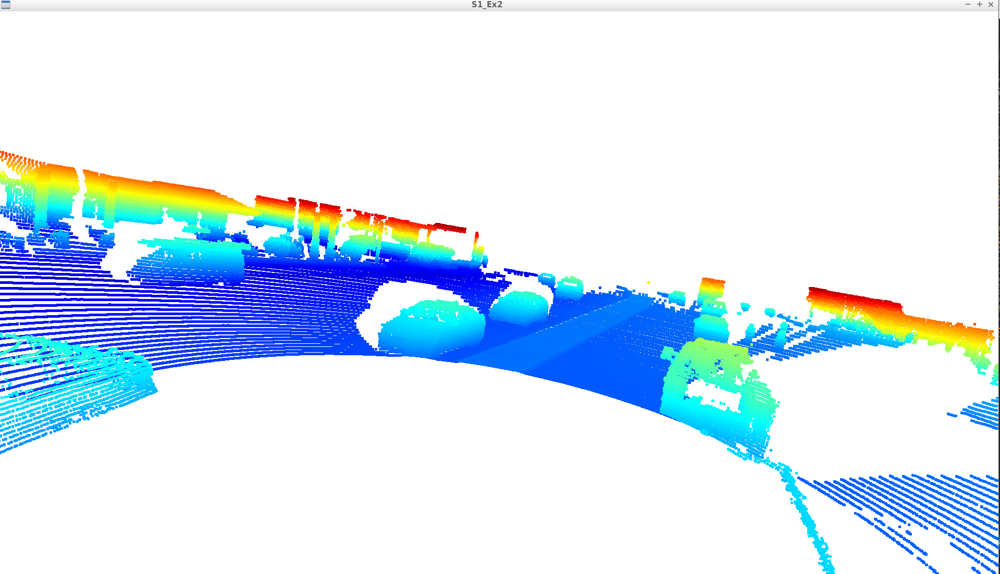
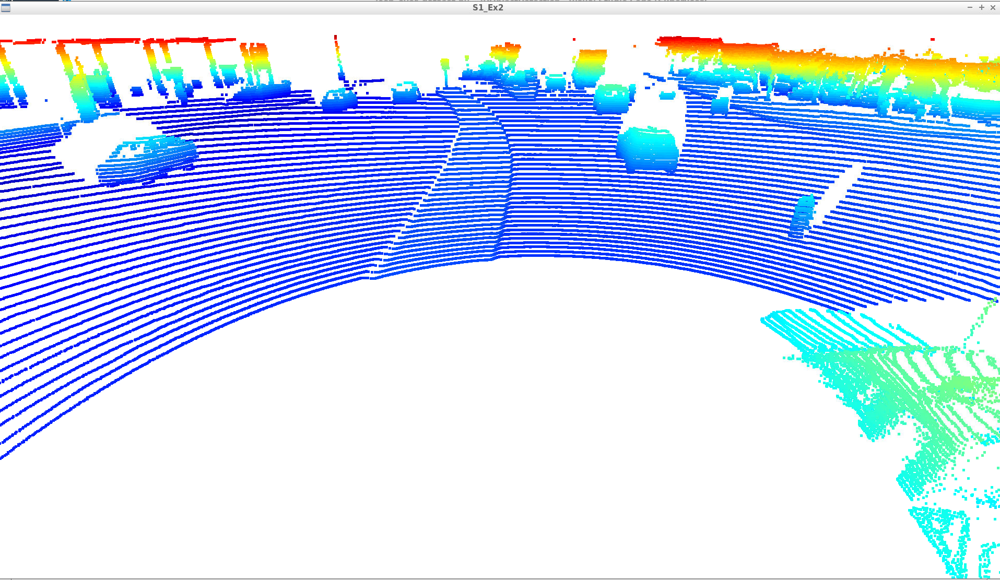
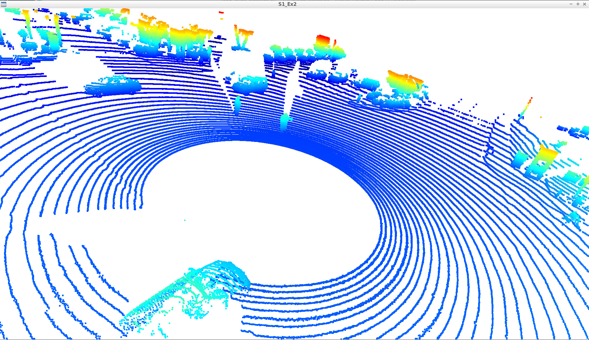
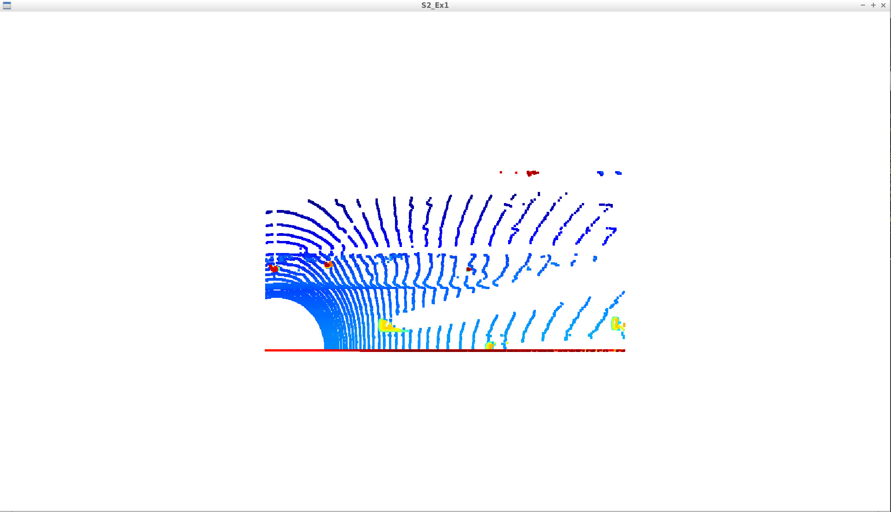
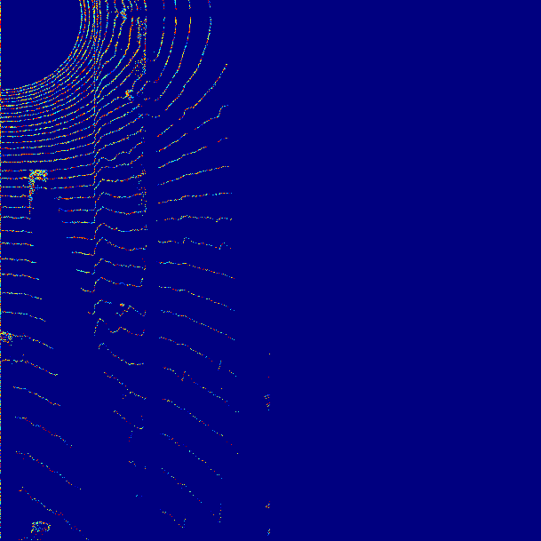

# Writeup: Track 3D-Objects Over Time

## ID_S1_EX1: Visualize range image channels
In this task the following things are obtained.
1. Range image is obtained
2. Intensity image is obtained
3. The image is cropped to view only =/- 90 degrees left and right
4. The image is converted into 8 bit channels

## ID_S1_EX2: Visualize Point-cloud
In this task the following things are obtained
1. 10 examples of vehicles in varying degree is found
2. It was noted that the stable arts of the vehicles found on point cloud are the front and back parts especially above the wheels. The front curves are visible clearly, similarly the back curves too.
3. One important thing is that vehicles very near to the Ego, or vehicles on a crowded space are difficult to grasp
4. The environmental assets like trees, bush are clearly visible

## ID_S2_EX1: Convert sensor coordinates to BEV-map coordinates
In this task, the following things are obtained
1. A BEV image of the point cloud is made

## ID_S2_EX2: Compute intensity layer of BEV-map
In this task, the following things are obtained
1. The intensity values in BEV-map is updated
2. Used normalization to eliminate the outliers
3. A heat map is made for the image created

Please use this starter template to answer the following questions:

### 1. Write a short recap of the four tracking steps and what you implemented there (filter, track management, association, camera fusion). Which results did you achieve? Which part of the project was most difficult for you to complete, and why?

### 2. Do you see any benefits in camera-lidar fusion compared to lidar-only tracking (in theory and in your concrete results)? 

### 3. Which challenges will a sensor fusion system face in real-life scenarios? Did you see any of these challenges in the project?

### 4. Can you think of ways to improve your tracking results in the future?

